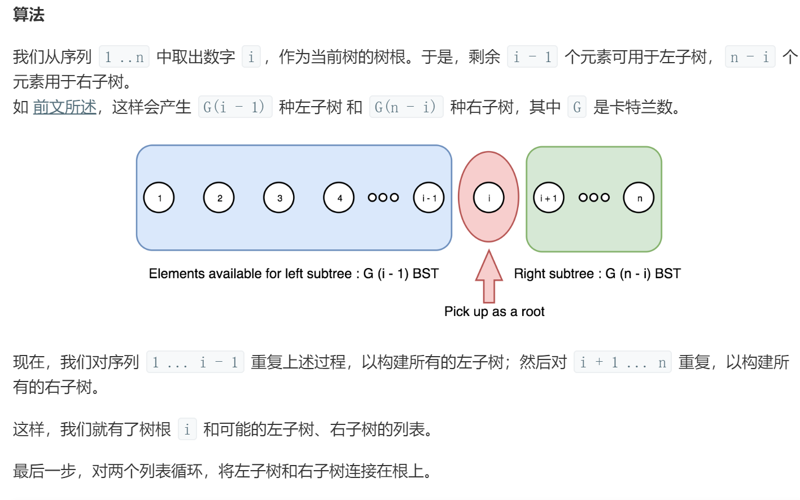

# 算法学习笔记

算法学习过程中，写出的经典算法和数据结构的代码，记录一下

## AVL树

AVL树没有去实现删除操作，暂未学习，我觉得和红黑树应该大致相同。AVL树中左右子树最多相差的高度为1。AVL树掌握左右旋即可，红黑树也要使用到左右旋。

## 红黑树

最难的是**红黑树**，自学了三天，才把插入删除弄明白。**红黑树的性质得背下来，这是学习的最最最基础**。

(1)删除操作

删除操作比较负责，情况较多，很多blog对删除讲的不明不白，推荐学习blog：[红黑树删除](https://www.cnblogs.com/zutterhao/p/7535878.html)。

删除有三种情况：

情况一：删除的是叶子结点，直接删除即可

情况二：删除的结点只有一个子结点，直接删除该节点，并用该节点的唯一子节点顶替它的位置

情况三：删除的结点有两个子结点，需要从右子树中找到最小节点替换，然后再去删除该替换结点，这样就将情况三转化成了情况一、二

删除完成后可能会违背红黑树的特性，所以需要通过"旋转和重新着色"来修正该树，使之重新成为一棵红黑树。

**注意：红黑树真正被删除的结点至多只有一个子结点。这一点很重要，在删除操作的分析时能带来很大的帮助**

(2)插入操作

用一张图来概括一下，**这里只是插入节点是父结点的左子结点的情况**，所有插入节点默认为红色


**总结一下：红黑树的删除和插入就是利用红黑树的性质，枚举所有可能情况，然后一一处理。这里的枚举是有限的**

红黑树应用广泛：Java的hashmap，c++STL的map和set，epoll等等

## KMP算法

笔试过程中，被考得最多的是KMP算法，用来对代码进行优化，降低时间复杂度，看到数楼房的题目首先就得想到KMP算法。

## 二叉树遍历

二叉树的遍历，除了掌握递归写法外，还得掌握非递归写法，因为一些情况下不能用递归实现遍历，

比如STL中的RB_TREE，increment和decrement就得用非递归来实现。

## 最短路径算法

Dijkstra、Bellman-Ford、SPFA、Floyd算法都是最短路径算法，其中：

①Dijkstra算法只能用来处理权值为正的单源最短路径，但是求权值全为正的最长路也能用Kruskal算法，方法就是将权值都转换为负数，此时能够求得最长路

②Bellman-Ford、SPFA也是求单源最短路问题，但是可以求权值为负数的情况，**但是要进行负环的判断**。SPFA算法是对Bellman-Ford算法的优化

③Floyd算法是全源最短路算法

## 最小生成树

prim算法和kruskal算法

**prim算法**：和Dijkstra算法差不多，就是数组D表示的是到达已构造好的树的估计最短距离，而Dijkstra算法数组D表示的是到达源点的估计最短距离

**kruskal算法**：最重要的是环的判断，使用到并查集，而并查集可以用路径压缩降低查找的时间复杂度。

## 希尔排序

希尔排序是对插入排序的优化，插入排序仅仅对小规模数据或者部分有序数据高效

利用希尔排序，将大规模数据划分成一段段小规模数据，划分的标准是将间隔相同的数据作为一组，然后对小规模数据使用插入排序，不断缩小间隔，当间隔为1时，整个大规模数据就是部分有序的了，再使用一次插入排序即可

## 双向链表与反转链表

我实现了一个双向链表，同时利用O(n)的时间复杂度完成反转双向链表。但其实反转双向链表没太大的意义，直接反方向遍历不就行了。因此反转链表多用在反转单向链表。

## 堆

堆是一棵完全二叉树，因此可以用数组来实现，数组下表从1开始，那么编号为i的左子结点为2\*i，右子结点为2\*i+1，父结点为i/2

## DAG最长路

可以使用动态规划也可以利用关键路径算法求。AOE.cpp是求关键路径。关键路径上的关键活动是不允许拖延的活动，这些活动的最早开始时间必须等于最迟开始时间。

对于求矩阵嵌套的问题，就是构造图，然后求DAG最长路。或者可以对矩阵数据进行预处理，保证前面的矩阵一定不可包住后面的矩阵，而后面的矩阵可能包住前面的矩阵，然后使用求最长不降子序列的方法求。

## 卡特兰数

卡特兰数是组合数学中的一种著名数列，通常用如下通项式表示：

​		f(n)=$\frac{C^n_{2n}}{n+1}$

当然，卡特兰数也是有递推式的：

​		f(n)=$\sum_{i=0}^{n-1}$f(i)*f(n-i-1)

第一个通项式的变形为：

​		f(n)=$C_{2n}^n$-$C_{2n}^{n-1}$

其前几项为(从第零项开始): 1, 1, 2, 5, 14, 42, 132, 429, 1430, 4862, 16796, 58786, 208012, 742900, 2674440, 9694845, 35357670, 129644790, 477638700,$\cdots$

### 应用：

**1、括号化问题**

**2、出栈次序问题。一个栈(无穷大)的进栈序列为1、2、3、...、n，有多少个不同的出栈序列**

类似：有2n个人排成一行进入剧场。入场费5元。其中只有n个人有一张5元钞票，另外n人只有10元钞票，剧院无其它钞票，问有多少中方法使得只要有10元的人买票，售票处就有5元的钞票找零？(将持5元者到达视作将5元入栈，持10元者到达视作使栈中某5元出栈)

**3、给定结点组成二叉搜索数树**

给定一个整数 *n*，求以 1 ... *n* 为节点组成的二叉搜索树有多少种

```cpp
int numTrees(int n) {
    	//动态规划
        // if(n==0) return 0;
        // int num[n+1];
        // memset(num,0,sizeof(num));
        // num[0]=1;
        // for(int i=1;i<=n;i++){
        //     for(int j=1;j<=i;j++){
        //         num[i]+=(num[j-1]*num[i-j]);
        //     }
        // }
        // return num[n];
    	
    	//卡特兰数
        long ans=1;
        for(int i=1;i<=n;i++){
            ans=2*(2*i-1)*ans/(i+1);
        }
        return (int)ans;
    }
```
分别是哪几种?



*(图片来源 LeetCod e第 95 题)*

~~~cpp
class Solution {
    struct TreeNode{
        int val;
 		TreeNode *left;
        TreeNode *right;
        TreeNode(int x) : val(x), left(NULL), right(NULL) {}
    };
    vector<TreeNode*> generateNode(int start,int end){
        vector<TreeNode*> tmp;
        if(start>end){
           
            tmp.push_back(NULL);
            return tmp;
        }
        for(int i=start;i<=end;i++){
            vector<TreeNode*> ltmp=generateNode(start,i-1);
            vector<TreeNode*> rtmp=generateNode(i+1,end);
            for(int j=0;j<ltmp.size();j++){
                for(int k=0;k<rtmp.size();k++){
                    TreeNode* node=new TreeNode(i);
                    node->left=ltmp[j];
                    node->right=rtmp[k];
                    tmp.push_back(node);
                }
            }
        }
        return tmp;
    }
public:
    vector<TreeNode*> generateTrees(int n) {
        vector<TreeNode*> ans;
        if(n==0) return ans;
        TreeNode* tmp=new TreeNode(1);
        return generateNode(1,n);
    }
};
~~~


