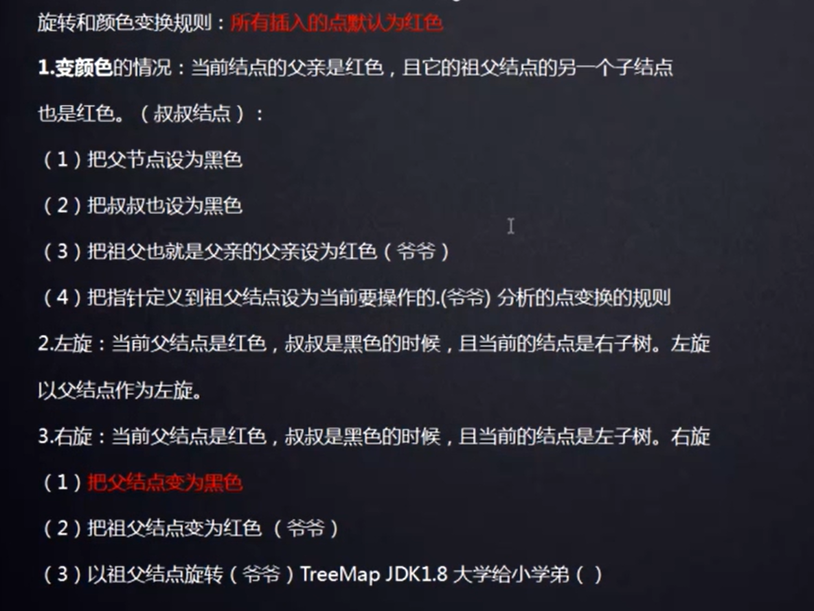

# 算法学习笔记

算法学习过程中，写出的经典算法和数据结构的代码，记录一下

## AVL树

AVL树没有去实现删除操作，暂未学习，我觉得和红黑树应该大致相同。AVL树中左右子树最多相差的高度为1。AVL树掌握左右旋即可，红黑树也要使用到左右旋。

## 红黑树

最难的是**红黑树**，自学了三天，才把插入删除弄明白。**红黑树的性质得背下来，这是学习的最最最基础**。

(1)删除操作

删除操作比较负责，情况较多，很多blog对删除讲的不明不白，推荐学习blog：[红黑树删除](https://www.cnblogs.com/zutterhao/p/7535878.html)。

删除有三种情况：

情况一：删除的是叶子结点，直接删除即可

情况二：删除的结点只有一个子结点，直接删除该节点，并用该节点的唯一子节点顶替它的位置

情况三：删除的结点有两个子结点，需要从右子树中找到最小节点替换，然后再去删除该替换结点，这样就将情况三转化成了情况一、二

删除完成后可能会违背红黑树的特性，所以需要通过"旋转和重新着色"来修正该树，使之重新成为一棵红黑树。

**注意：红黑树真正被删除的结点至多只有一个子结点。这一点很重要，在删除操作的分析时能带来很大的帮助**

(2)插入操作

用一张图来概括一下，**这里只是插入节点是父结点的左子结点的情况**，所有插入节点默认为红色

**总结一下：红黑树的删除和插入就是利用红黑树的性质，枚举所有可能情况，然后一一处理。这里的枚举是有限的**

红黑树应用广泛：Java的hashmap，c++STL的map和set，epoll等等

## KMP算法

笔试过程中，被考得最多的是KMP算法，用来对代码进行优化，降低时间复杂度，看到数楼房的题目首先就得想到KMP算法。

## 二叉树遍历

二叉树的遍历，除了掌握递归写法外，还得掌握非递归写法，因为一些情况下不能用递归实现遍历，

比如STL中的RB_TREE，increment和decrement就得用非递归来实现。

## 最短路径算法

Dijkstra、Bellman-Ford、SPFA、Floyd算法都是最短路径算法，其中：

①Dijkstra算法只能用来处理权值为正的单源最短路径，但是求权值全为正的最长路也能用Kruskal算法，方法就是将权值都转换为负数，此时能够求得最长路

②Bellman-Ford、SPFA也是求单源最短路问题，但是可以求权值为负数的情况，**但是要进行负环的判断**。SPFA算法是对Bellman-Ford算法的优化

③Floyd算法是全源最短路算法

## 最小生成树

prim算法和kruskal算法

**prim算法**：和Dijkstra算法差不多，就是数组D表示的是到达已构造好的树的估计最短距离，而Dijkstra算法数组D表示的是到达源点的估计最短距离

**kruskal算法**：最重要的是环的判断，使用到并查集，而并查集可以用路径压缩降低查找的时间复杂度。

## 希尔排序

希尔排序是对插入排序的优化，插入排序仅仅对小规模数据或者部分有序数据高效

利用希尔排序，将大规模数据划分成一段段小规模数据，划分的标准是将间隔相同的数据作为一组，然后对小规模数据使用插入排序，不断缩小间隔，当间隔为1时，整个大规模数据就是部分有序的了，再使用一次插入排序即可

## 双向链表与反转链表

我实现了一个双向链表，同时利用O(n)的时间复杂度完成反转双向链表。但其实反转双向链表没太大的意义，直接反方向遍历不就行了。因此反转链表多用在反转单向链表。

## 堆

堆是一棵完全二叉树，因此可以用数组来实现，数组下表从1开始，那么编号为i的左子结点为2\*i，右子结点为2\*i+1，父结点为i/2

## DAG最短路

可以使用动态规划也可以利用关键路径算法求。AOE.cpp是求关键路径。关键路径上的关键活动是不允许拖延的活动，这些活动的最早开始时间必须等于最迟开始时间。

对于求矩阵嵌套的问题，就是构造图，然后求DAG最长路。或者可以对矩阵数据进行预处理，保证前面的矩阵一定不可包住后面的矩阵，而后面的矩阵可能包住前面的矩阵，然后使用求最长不降子序列的方法求。